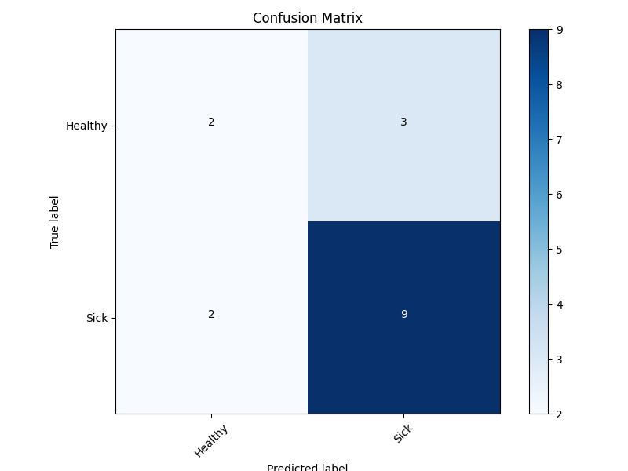

# AHEAD Medicine Interview Questions

## 環境資料準備
1. 拉取專案。
```
git clone https://github.com/Shane-Kao/ahead-miq.git
```
2. 使用 `conda` 建置虛擬環境。
```
conda env create -f environment.yml
```

3. 激活虛擬環境。
```
conda activate ahead-miq
```

4. 將以下三個資料來源 (from gdrive) 放在 *ahead-miq* 目錄下：
    - *raw_fcs* 目錄 
    - *EU_label.xlsx*
    - *EU_marker_channel_mapping.xlsx*

5. 專案目錄結構如下：
```text
ahead-miq
    ├─raw_fcs 
    ├─EU_label.xlsx 
    ├─EU_marker_channel_mapping.xlsx
    ├─.gitignore
    ├─environment.yml
    ├─fcs_reader.py (讀取 .fcs 格式檔案)
    ├─feature_extractor.py (特徵抽取)
    ├─main.py (訓練與評估)
    ├─plot_confusion_matrix.py (混淆矩陣圖繪製)
    ├─README.md
```


## 訓練
### 訓練測試資料
- 訓練 24 筆，測試 16 筆。
- 訓練包含 17 *Sick* and 7 *Healthy*。
- 測試包含 11 *Sick* and 5 *Healthy*。

### 特徵
#### 抽取
1. 以 `flowrepo_covid_EU_002_flow_001` 為例，資料共有 363314 列，35 行，代表 363314 次測量 35 個特徵的數值。
2. 針對每個特徵 (每一行) 計算以下：
   1. mean
   2. std
   3. min
   4. max
   5. median
   6. count
   7. Q1
   8. Q3
   9. skew
   10. kurtosis

3. 透過以上 summary encoder 的方式，每一筆數據可以生成 35 * 10 = 350 個特徵。
#### 選取 
1. 主要考慮以下兩種方法：
   1. `sklearn.feature_selection.f_classif`：Compute the ANOVA F-value for the provided sample.
   2. `sklearn.feature_selection.mutual_info_classif`：Estimate mutual information for a discrete target variable.
2. 計算上述兩個方法，保留分數較高的特徵，使用 `sklearn.feature_selection.SelectPercentile`。
3. 使用的方法與選取的特徵個數會作為參數，後續模型調參時會決定。

### 標準化
考量到特徵尺度各不相同，使用
`sklearn.preprocessing.StandardScaler`：Standardize features by removing the mean and scaling to unit variance.

### 模型
- 候選模型清單：
  - Random Forest
  - Bagging
  - Logistic Regression
- 使用的模型會作為參數，後續模型調參時會決定。
- 調參：
  - 參數組合(共 18 組)：
    - 特徵抽取方法：`sklearn.feature_selection.f_classif` or `sklearn.feature_selection.mutual_info_classif`
    - 特徵抽取個數：原始個數 350 的 25%，50% 或 75%
    - 模型：Random Forest，Bagging or Logistic Regression
  - 做 3 fold 的 cross validation。
  - 透過網格搜尋計算不同參數組合的平均評估值，並選取最高的那組參數組合。
  - 評估值使用 *F1 Score*。
- 最後用最佳的參數組合，用完整的訓練資料集訓練最終模型。
- 透過以下指令觸發訓練流程：

```shell
python main.py
```

- 調參結果：
  - 特徵抽取方法：`sklearn.feature_selection.f_classif`
  - 特徵抽取個數：原始個數 350 的 75%
  - 模型：Logistic Regression
  - F1-Score 的平均為 0.842
- 使用 `sklearn.model_selection.GridSearchCV` 做調參與模型訓練。

## 結果評估
```text
Evaluation on Test set:
              precision    recall  f1-score   support
     Healthy       0.50      0.40      0.44         5
        Sick       0.75      0.82      0.78        11
    accuracy                           0.69        16
   macro avg       0.62      0.61      0.61        16
weighted avg       0.67      0.69      0.68        16
```


- Sick 類別的 F1-Score 為 0.78，較稍早調參時最佳分數 0.842 低。
- Healthy 類別分類效果較差，可以調整
  - 資料平衡
  - 調參時優化的評估值
  - 計算模型輸出的分數，設置合適的閾值

## Miscellaneous
- 目前設置 random seed 的前提下，理論上實驗結果可以重現，不過 cv 那邊沒有看到相關的 random seed 參數，這邊還需要確定一下做 cv 時，切分資料的邏輯。
- 訓練時用上了所有的內核，可調整 main.py 第 98 行，`n_jobs` 參數。

## 參考資料
- https://drive.google.com/drive/folders/1-cd2q66nW9qMf4GbY2kSLTogfZcaaNXS
- https://taborlab.github.io/FlowCal/
- https://www.kaggle.com/code/grfiv4/plot-a-confusion-matrix
- https://scikit-learn.org/stable/modules/generated/sklearn.feature_selection.f_classif.html#sklearn.feature_selection.f_classif
- https://scikit-learn.org/stable/modules/generated/sklearn.feature_selection.mutual_info_classif.html#sklearn.feature_selection.mutual_info_classif
- https://scikit-learn.org/stable/modules/generated/sklearn.preprocessing.StandardScaler.html#sklearn.preprocessing.StandardScaler